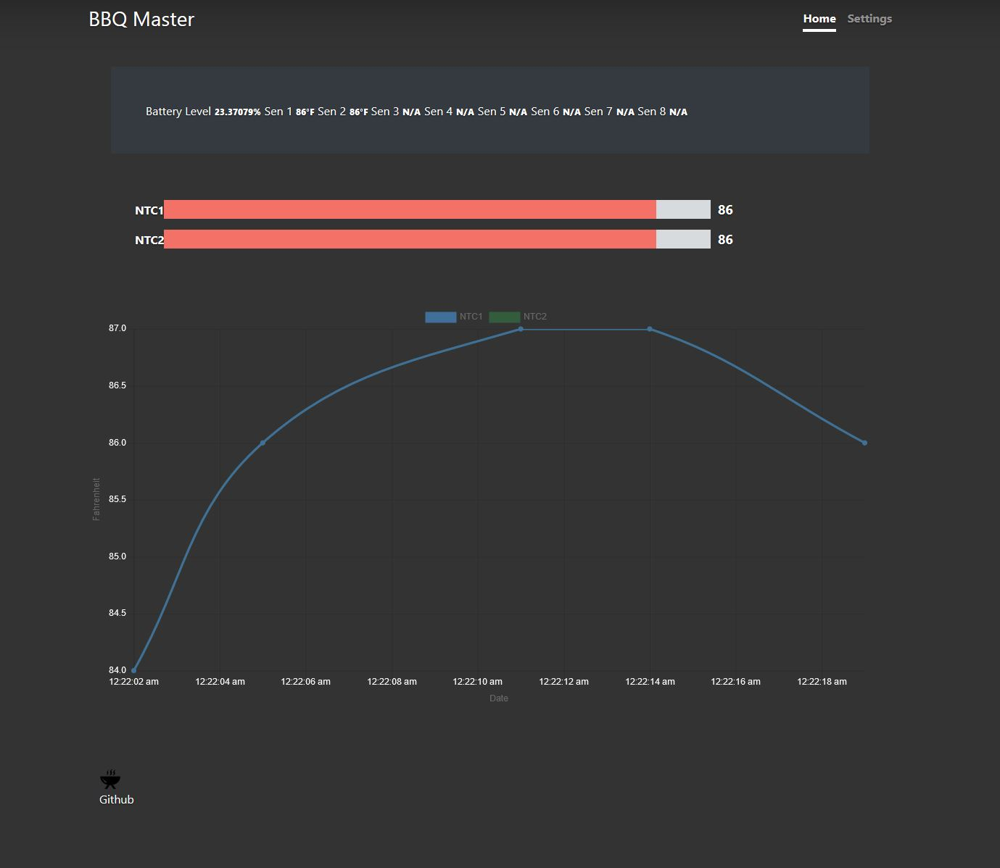
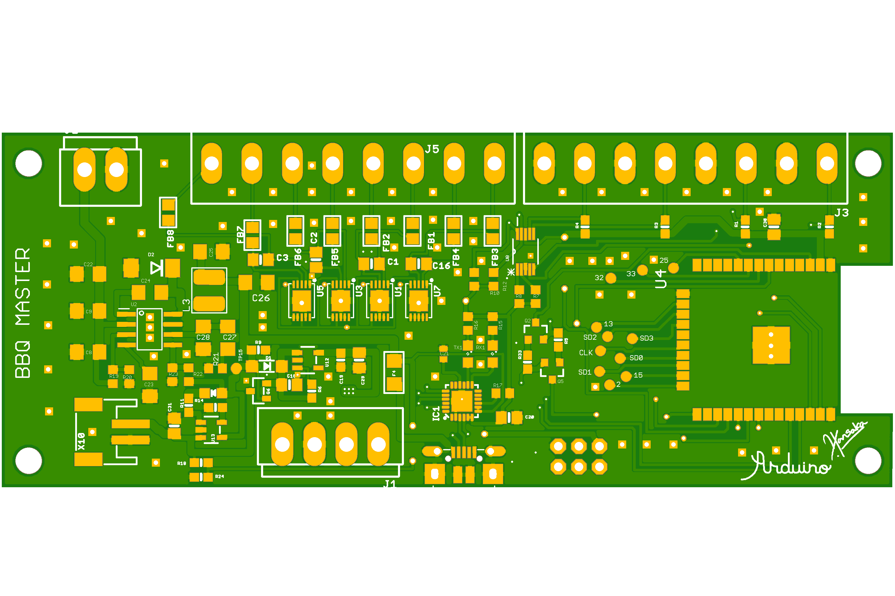
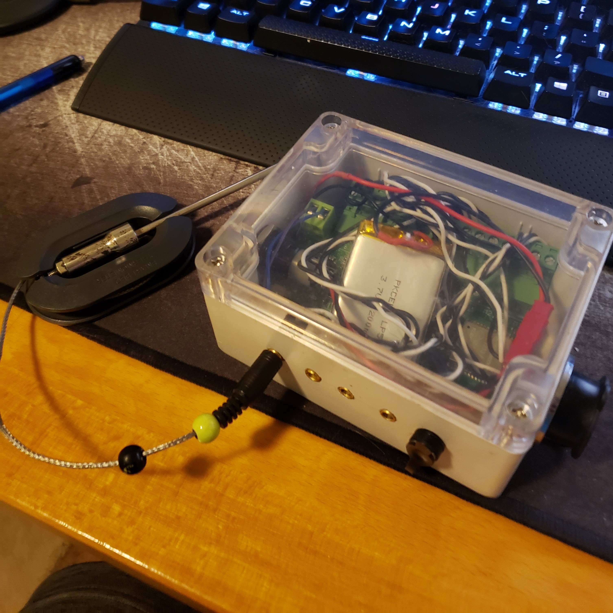
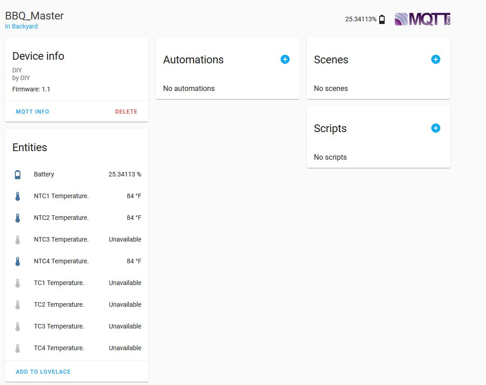

# BBQMaster
8 channel temperature monitor for barbecuing.

# Features
* 4 NTC thermistor channels.
* 4 K-type thermocouple channels.
* Web interface to monitor the temperatures.
* MQTT support with hassio auto discovery.
* OTA updates.
* Web portal.

# Background
I got into smoking meat last few years and figured out maintaining the temperature is a big part of getting juicy results. Like everyone else, I do not have patience to stay right next to the smoker to monitor the temps. Specially if you have a cheaper lower-end smoker; monitoring the temperature is crucial. The usual solution is to buy a wireless temp monitor out of Amazon so if you find one that works for you, go for it. My solution here is expensive, close to 100$. I ended up creating this project because I broke two sub 50$ sensors and a upgrade will cost around 100$. Hence I decided to make one knowing I can create one less than 100$ plus I had fun creating it.

I had few requirements.
1) Monitor temperature over a web interface or a app.
2) Wireless.
3) Enough probes to monitor every corner of a brisket.
4) Be able to monitor the inside of the smoker and maybe the fire box.

Knowing the requirements, I decided to go with
1) 4 NTC probe inputs since its easy to find commercial probes online.
2) 4 thermocouple inputs for higher temperature monitoring. Why? NTC probes cannot handle high heat. They will degrade really fast when you put them over 300F.
3) Use esp32 as the brain because its cheap and easy to program.

# How to order and build the board
Board files are in "boards/" folder. Design in Eagle and you can just drop the zip file located in baord/bbqsensor/cam/ into jlcpcb.com to get them made.

Board design:
* 100mmx54mm 2-layer board.
* Jelly bean parts are 603 or above.
* Uses CP2104 as the USB interface.
* Buck coveter based on TPS54331DR. This will allow 9v-24v input.
* Lipo charging based on MCP73831.
* 3v3 Regulator based on AP2112.
* Thermocouple input handled by OneWire MAX3185.
* NTC thermistors are monitored by ADS1115 ADC for better accuracy.
* ESP32 as the brain.
* Terminal block connectors for easy connections.

For the bom, look at the schematic.

DISCLAIMER:
I'm a amature designer. I would recommend going over the schematic before ordering.

## Probes

### NTC
Most common replacement bbq probes will work. I bought https://www.ebay.com/itm/Chugod-Grilling-BBQ-Meat-Thermometer-Probe-Replacement-Temperature-Probes-4-Pa/402310429902?hash=item5dab91fcce:g:aDoAAOSwulde-Xr3

### K-type
You can buy any shape or size you want. However it is very hard to find probes designed for food. I would recommend use the thermocouple probes just to measure the inside temperature or firebox temperature.

# How to compile.
1) Download and install vscode with platformio. https://platformio.org/
2) Modify the platformio.ini file to either use serial port or use over the air updates.
3) If you are using Windows to compile, you might run into an compiler error because of Timelib. There are two headers named time.h in esp32 core and Time.h in Arduino timelib. These two looks the same to the compiler in windows because windows file names are case insensitive. Solution is to delete .pio/libdeps/myenv/Time/Time.h. More info https://github.com/esp8266/Arduino/issues/2341
4) Press upload.
5) Upload SPIFF image by running the vscode task "Upload File System Image". You can get to the task list from the left platformio panel or by typing "CTRL+SHIFT+P->Run task->platformio->Upload file system image".

# How to configure.
Firmware needs to know the MQTT server configuration. This can be done using WIFI manager portal. 
When you upload the code, if there is no previous credentials saved in the memory, WIFI AP will starts to broadcast using the name BBQ_Master. Connect to it and use the web portal to enter in the WIFI info as well as MQTT server address and the port. This creates a file in SPIFF called config.json. If you failed to enter the correct information or wants to modify the configuration later, create a file name config.json with data/ folder then use the "Upload file system Image" task to push the new file out.
config.json should looks like:
``
{"mqtt_server":"example.com", "mqtt_port":"1883"}
``

## Home Assistant
Turn on MQTT auto discovery https://www.home-assistant.io/docs/mqtt/discovery/. If esp32 connected to the MQTT server then hassio will automatically discover the device. If you are using non default discovery_prefix within hassio then change MQTT_HOME_ASSISTANT_DISCOVERY_PREFIX within the code reflect it.

# Known issues
* Forgot to add a LED indicator to the board.
* There is no way to turn off. As a workaround I attached a switch in series with the battery.
* Pubsub library only let you add a one "will" message. Because of this hassio sometimes fails to put all temperature sensor into unavailable state when disconnecting power from the device.
* Web interface theme functionality is broken.

# Todo
* Clean up the web interface.
* Add the ability to configure the temperature probe names through the web interface.
* Ability to calibrate the temperature probes using the web interface.
* Add a proper gauge to the battery indicator in the web interface.
